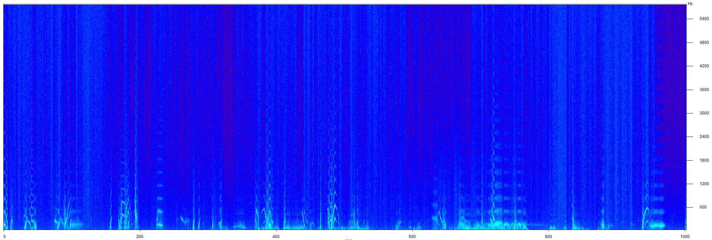

# CW Radar Recordings

These are raw CW radar recordings made by a modified Hi-Link LD2415H vehicle speed radar.

[Reverse Engineering was done by me before](https://www.dm5tt.de/2025/02/15/reverse-engineering-hilink-ld2415h/).

# Configuration

2 Byte per sample

16 Bit ADC resolution

50kHz ADC speed

Varef = 3.3V

The parameters of the antenna can be found if you google for the "HLK-LD2415" datasheet. The transmitter/antenna itself wasn't modified.

# Recording Chain

# Setup Verification

Test against a Loudspeaker that generated a Sinus on 50Hz/100Hz/150Hz/200Hz.

# Recording examples

## street_1741443997_1741444997_4

