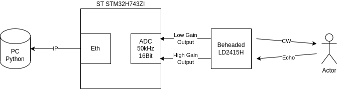
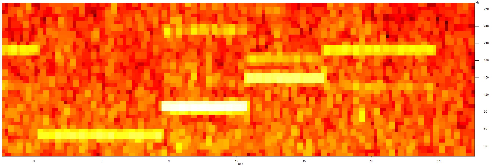

# CW Radar Recordings

These are raw CW radar recordings made by a modified Hi-Link LD2415H vehicle speed radar.

[Reverse Engineering was done by me before](https://www.dm5tt.de/2025/02/15/reverse-engineering-hilink-ld2415h/).

[Article to this recodings](https://www.dm5tt.de/2025/03/09/high-resolution-cw-recordings/).

# Configuration

Radar:
 - Frequency: ~24.125GHz
 - EIRP: ~18dBm

ADC
* 2 Byte per sample (uint16_t)
* 16 Bit ADC resolution
* 50kHz ADC speed
* V_aref = 3.3V

The parameters of the antenna can be found if you google for the "HLK-LD2415H" datasheet.

The transmitter/antenna itself wasn't modified.

# Recording Chain

# Setup Verification

Radar test against the loudspeaker membrane that generated a sinus on 50Hz/100Hz/150Hz/200Hz.

